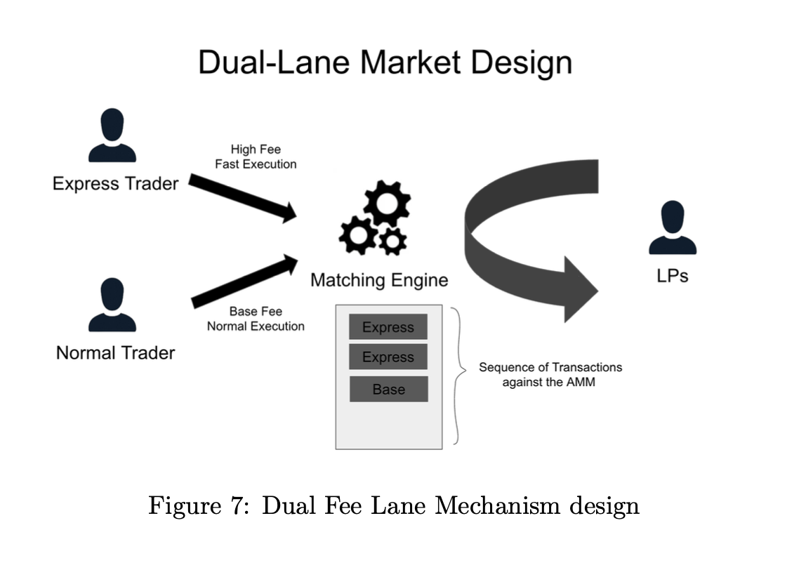
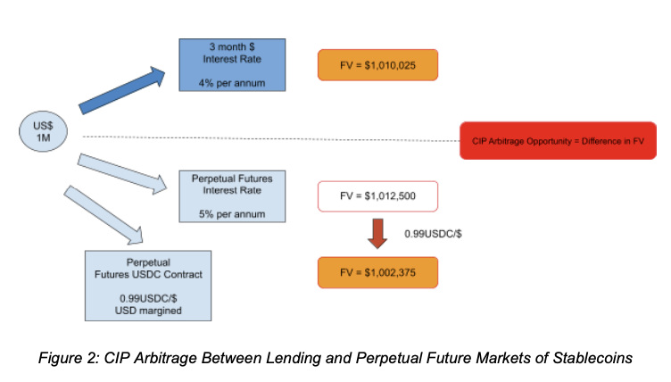
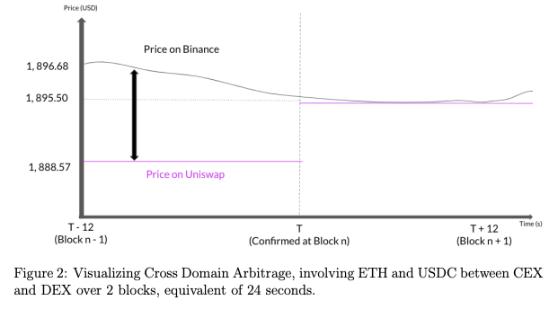
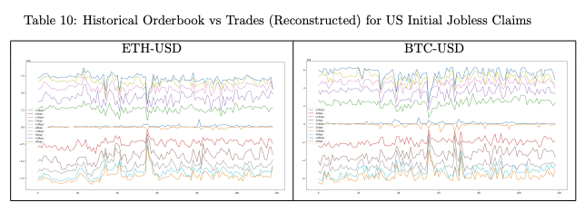

**Urgency-Premium Pricing and Batch Auctions - A Dual-Lane Mechanism for AMM-Based Prediction Markets**
------

Prediction makers offer a compelling vision for decentralized forecasting, yet they struggle with issues of liquidity, price accuracy, and front-running. This paper proposes a novel dual-lane mech- anism designed to enhance the efficiency and robustness of such markets: Urgency-Premium Pricing and Batch Auctions. The urgency premium lane allows users to execute trades immediately by paying a dynamically determined premium, ensuring prompt execution for time sensitive information. Simultaneously, the batch auctions lane periodically processes a collection of trades at an aggregated price, mitigating the impact of toxic flows for liquidity providers. Through an initial theoretic analysis, I demonstrate that this mechanism creates a more resilient and user-friendly prediction market environment that balances the economic incentives of both traders and liquidity providers.

 

**Covered Interest Parity Deviations of Stablecoins**
------
The market capitalization of stablecoins has surged from US$5 billion in 2019 to over US$180 billion in 2022. These blockchain-based assets emulate traditional currencies with unique stabilizing mechanisms. This study examines the efficacy of stablecoin mechanisms through covered interest parity (CIP), which suggests that interest rate differentials between currencies should align with forward and spot exchange rate differentials. It includes vector autoregression (VAR) models to monitor shocks from the FTX Collapse and USDC depeg; convenience yield theory from the lens of transaction frictions on-chain ('gas') and the influx of liquidity from Binance's USDC-USDT launch.

 

More Info: [GitHub Repository](https://github.com/ccwhgetgit/Covered-Interest-Parity-Deviations-Stablecoins)

**Beyond Borders: Exploring Maximal Extractable Value (“MEV”) and Risks in Cross-Domain CEX-DEX Arbitrage**
------
The paper investigates Maximal Extractable Value (MEV) and the associated risks in cross-domain arbitrage between centralized exchanges (CEX) and decentralized exchanges (DEX) on Ethereum. It provides a comprehensive analysis of the opportunities and challenges presented by MEV in the context of cross-domain trading, offering insights into the evolving landscape of the blockspace markets. In particular, over 38 million transactions were analyzed to extract these arbitrages and the value of toxic flow due to the AMM designs were estimated. 
* Accepted for UBRI 2024 @ ETH Zurich

 

More Info: [Research Post](https://ethresear.ch/t/empirical-analysis-of-cross-domain-cex-dex-arbitrage-on-ethereum/17620); [Github Repository](https://github.com/ccwhgetgit/HonorsThesis)

**Credit Risk Management (Lending Club)**
-----
The paper focuses on Lending Club, the first P2P lender to have registered its offerings in the United States. The company enables investors to independently evaluate the credit risk of listed loans based on the borrowers’ profiles. These come in various grade schemes and interest rates, where a higher interest tends to lead to a poorer credit grade. Using the publicly available dataset, machine learning models and classifiers (XGBoost, Logistic Regression, Random Forest, K-Means Clustering) were built to identify characteristics common amongst groups of borrowers. These aimed to provide more accurate credit profiling for good customers to enhance borrower satisfaction and trust.

More Info: [Github Repository](https://github.com/ccwhgetgit/CreditRiskManagement_LendingClub)

**Liquidity Providers' Incentive Program (dYdX)**
-----
Liquidity providers are currently incentivised to provide liquidity through the LP Incentives Programme. Based on the various parameters - makerVolume, depths and spreads, they are rewarded accordingly based on their activities. By systematically analyzing the liquidity and trading activities, a series of criteria were introduced to distill the markets - tick sizes, reconstructed orderbooks vs actual liquidity, orderbook resilience during high market impact events (half life estimation). 

 

More Info: [Grant Information](https://www.dydxgrants.com/grants/lp-rewards-formula-optimization); [Github Repository](https://github.com/ccwhgetgit/dYdX_LPRewardsOpt)
